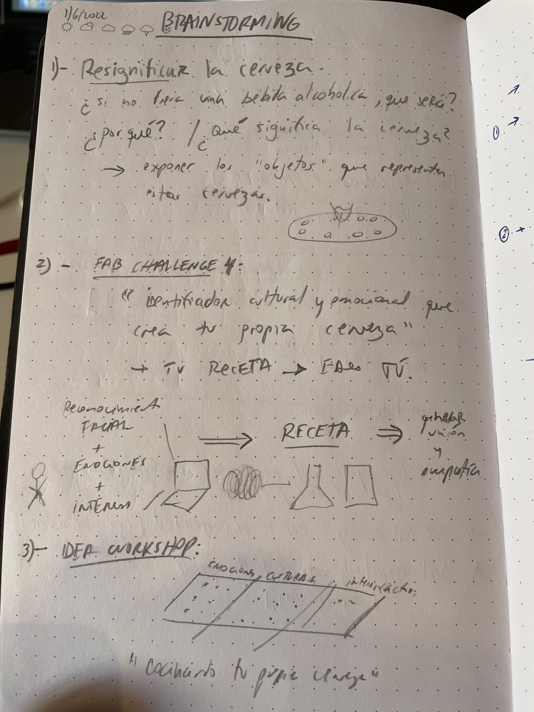

# Micro Challenge 4: Integrated prototype that helps your MDEF Project and integrates the range of units covered. 

## How is this linked to my research area?

My research has focused on seeking new ways of building relationships and ‘giving voice to agents that usually do not have it’, generating awareness about critical scenarios that affect society. My work includes food culture, art, craftsmanship, migration, generating learning and sharing environments as a source of inspiration for new narratives that can impact education and social development.

## Initial Idea/Concept of the Project

Propose (what is supossed to do)

Planification and Execution

System Diagram (illustration explaining function, parts and relations=

Integrated Design
Honest Design
Be Creative
Explore Design Boundaries
Future Development
Long Term Dissemination Plan: It means how will you raise awareness of your project amongst the target group. The dissemination plan might answer questions such as: who is your project for, how is it funded, is there a license you chose or something else to protect intellectual properties of your project, is there a business plan, how would you fund scaling up, etc.
