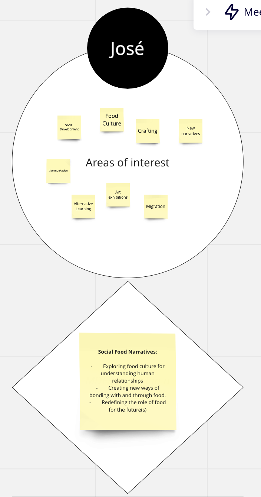
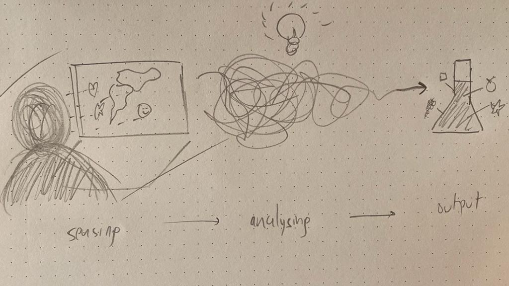
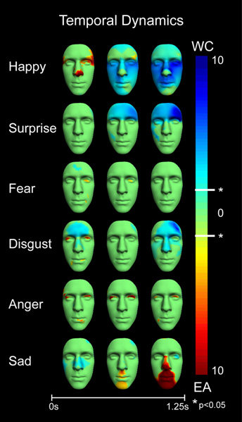
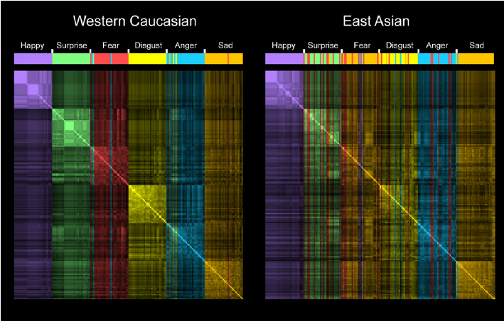
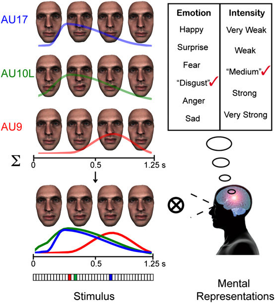
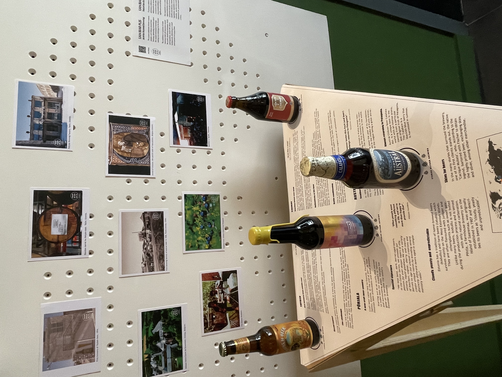

# Micro Challenge 4: Integrated prototype that helps your MDEF Project and integrates the range of units covered. 

## How is this linked to my research area?

My research has focused on seeking new ways of building relationships and ‘giving voice to agents that usually do not have it’, generating awareness about critical scenarios that affect society. My work includes food culture, art, craftsmanship, migration, generating learning and sharing environments as a source of inspiration for new narratives that can impact education and social development.

Social Food Narratives is a research project that gives a new role to food, exploring the meaning behind it, for understanding culture, regenerating communities, and seeking human relationships with the world.

- Exploring food culture for understanding human relationships
- Creating new ways of bonding with and through food.
- Redefining the role of food for the future(s)

## Initial Idea/Concept of the Project

The main concept is about an inteligent machine/software that can identify people´s culture and emotions, transforming it into a  unique beer recipe. 

The project is called **Bottling Identities** and it is using beer as an outcome to explore cultures and generate empathy for social development.

Personal reflection: https://www.youtube.com/embed/DV1d7ibOwa4

## Proposal

What if we could embodied ourselves in another thing? The proposal for this project is to explore the possibility of transforming a person´s identity into a specific type of beer. 

Using artificial intelligence we could program a software that allow as to categorize people´s identities into different topics such as: emotions, skills, attitudes, culture, among others. With sensors we could detect and allign different movements and sounds, getting information from the exterior and transforming it into a numeric value. Each value would have a different meaning according to the previous classification we gave to identities.

For the beer final output, the research includes understanding the crafting process and selecting the the exact mix and amount of ingredients that make the beer unique an special, according to each identity. 

## Planification and Execution

### Stage 1: Research Emotions and Facial Recognition

Random generative grammar of facial movements and the perceptual categorization of emotions. (Stimulus) On each experimental trial, the facial movement generator randomly selected a subset of facial movements, called action units (AUs) (here, AU9 color coded in red, AU10 Left in green, and AU17 in blue) and values specifying the AU temporal parameters (see color-coded temporal curves). On the basis of these parameters, the generator rendered a three-dimensional facial animation of random facial movements, illustrated here with four snapshots. The color-coded vector Below represents the 3 (of 41) randomly selected AUs comprising the stimulus on this illustrative experimental trial. (Mental representations) Observers categorized each random facial animation according to the six basic emotion categories (plus "don't know") and rated the emotional intensity on a five-point scale. Observers will interpret the random facial animation as a meaningful facial expression (here, "disgust," "medium intensity") when the facial movements correspond to the observer's mental representation of that facial expression. Each observer (15 Western Caucasian and 15 East Asian) categorized 4,800 such facial animations of same and otherrace faces.

Spatiotemporal location of emotional intensity representation in Western Caucasian and East Asian culture. In each row, color-coded faces show the culture-specific spatiotemporal location of expressive features representing emotional intensity, for each of the six basic emotions. Color coding is as follows: blue, Western Caucasian; red, East Asian, where values reflect the t statistic. All color-coded regions show a significant (P < 0.05) cultural difference as indicated by asterisks labeled on the color bar. Note for the EA models (i.e., red face regions), emotional intensity is represented with characteristic early activations.

*Facial expressions of emotion are not culturally universal, Rachel E Jack, University of Glasgow*

### Stage 2: Categorization

Part of my research project is about understanding different cultures that are beyond brewing.A series of interviews to different master brewers, brewery owners and people related to craft beer. Each interview is conducted by video call or in person depending on the location.

The questions that guide each interview are: - Present yourself. (Who are you?) - Tell the story about this brewery. How and why was born? - What does this beer(s) represent? - If you could make a beer that represents the world right now, how would it be? - What is beer going to mean in the future?

In the last months I have contacted more than 20 craft breweries around the world and the interviews are in process.

One specific interview that was special for me was with Canaan Khoury, from Taybeh Bewing Company. This is the only brewery from Palestine. We talked about immigration, challenges of a country that has been in constant war, lifestyle and the future of beer and society. It was meaningful because my ancestors are from Palestine and came to Chile looking for opportunities, so I felt emotional and empathize with the stories behind brewing.

### Stage 3: Exploring Machine Learning

I got very inspired with the software: Wekinator. The Wekinator is free, open source software. Wekinator 1.0 was originally created in 2009 by Rebecca Fiebrink. In 2015, Rebecca released Wekinator 2.0, an entirely new version with redesigned interactions, new algorithms, and ability to connect easily to dozens of other creative coding tools and sensors. Wekinator 2.0 continues to be gently updated with bug fixes and feature requests.It allows anyone to use machine learning to build new musical instruments, gestural game controllers, computer vision or computer listening systems, and more. The Wekinator allows users to build new interactive systems by demonstrating human actions and computer responses, instead of writing programming code.

Example applications include: Creation of new musical instruments, Create mappings between gesture and computer sounds. Control a drum machine using your webcam! Play Ableton using a Kinect!, Creation of gesturally-controlled animations and games, Control interactive visual environments created in Processing, OpenFrameworks, or Quartz Composer, or game engines like Unity, using gestures sensed from webcam, Kinect, Arduino, etc.
Creation of systems for gesture analysis and feedback, Build classifiers to detect which gesture a user is performing. Use the identified gesture to control the computer or to inform the user how he’s doing. Creation of real-time music information retrieval and audio analysis systems.
More info in: http://www.wekinator.org

For prototyping facial recognition I used a Teachable Machine. I decided to work with 4 basic emotions (happiness,sadness, anger, fear) and test it in a first person perspective, analyzing my own facial expressions. 

A short video of prototyping: https://www.youtube.com/watch?v=rBQayGb0dLk

## System Diagram (illustration explaining function, parts and relations)

Integrated Design
Honest Design
Be Creative
Explore Design Boundaries
Future Development

As the interviews are getting done, I am getting fascinated by the stories, different people, and culture, so the next step is to prepare a mini documentary that can show “the stories behind brewing”.

Long Term Dissemination Plan: It means how will you raise awareness of your project amongst the target group. The dissemination plan might answer questions such as: who is your project for, how is it funded, is there a license you chose or something else to protect intellectual properties of your project, is there a business plan, how would you fund scaling up, etc.
